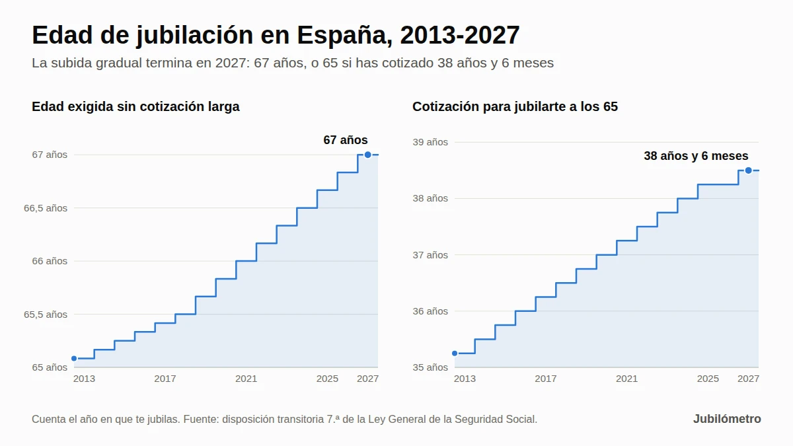

---
# Ficha de publicación (ver ficha-seo.md para el detalle)
titulo_seo: "Edad de jubilación en 2027: tabla por año de nacimiento"
h1: "Edad de jubilación en 2027: tabla por año de nacimiento y años cotizados"
meta_descripcion: "En 2027 te jubilas a los 67 años, o a los 65 con 38 años y 6 meses cotizados. Tabla por año y mes de nacimiento, ejemplos y errores frecuentes."
url: /jubilacion/edad-de-jubilacion/
categoria: Jubilación
palabra_clave_principal: edad de jubilación 2027
intencion: informativa
fase_plan: F1 (artículo n.º 1 del plan de contenidos)
fecha_actualizacion: 2026-09-27
fecha_publicacion: PENDIENTE
autor: "Pau Lobato (equipo editorial de Jubilómetro)"
estado: borrador pendiente de revisión profesional
imagen_destacada: imagenes/edad-jubilacion-2013-2027.webp
imagen_alt: "Gráfico de la subida de la edad de jubilación en España entre 2013 y 2027"
miga: Edad de jubilación
fuentes_legales:
  - https://www.boe.es/buscar/act.php?id=BOE-A-2015-11724
  - https://www.boe.es/buscar/act.php?id=BOE-A-2011-13242
  - https://www.boe.es/buscar/act.php?id=BOE-A-2022-9850
  - https://www.boe.es/buscar/act.php?id=BOE-A-2026-11474
proxima_revision: enero de 2027 (y cuando cambie la normativa)
---

# Edad de jubilación en 2027: tabla por año de nacimiento y años cotizados

*Actualizado el 27 de septiembre de 2026 · Por Pau Lobato, equipo editorial de Jubilómetro · Fuentes verificadas en el BOE*

> **Respuesta rápida**
>
> En 2027 la edad ordinaria de jubilación en España llega a los **67 años**. Si has cotizado **al menos 38 años y 6 meses**, puedes jubilarte a los **65 años** sin recorte en la pensión. Con 2027 termina el calendario de subida que empezó en 2013; con la ley actual, estas edades ya no cambian en los años siguientes.
>
> Lo que decide tu edad es **el año en que te jubilas**, no el año en que naciste. Por eso, si naciste entre marzo y diciembre de 1960 y no llegas a esa cotización, te jubilarás a los 67 años, en 2027, y no a los 66 años y 8 meses que indican muchas tablas.

## Datos clave de la jubilación en 2027

<!-- tabla: Requisitos de edad y cotización en 2027 -->
| Concepto | En 2027 |
|---|---|
| Edad ordinaria de jubilación | 67 años |
| Jubilación a los 65 sin recorte | Con 38 años y 6 meses cotizados o más |
| Cotización mínima para tener pensión | 15 años, 2 de ellos dentro de los últimos 15 |
| Años cotizados para cobrar el 100 % | 37 años |
| Jubilación anticipada voluntaria | Desde los 65 años con 35 años cotizados (desde los 63 si tienes 38 años y 6 meses) |
| Jubilación anticipada involuntaria | Desde los 63 años con 33 años cotizados (desde los 61 si tienes 38 años y 6 meses) |

Fuente: artículos 205, 207 y 208 y disposiciones transitorias 7.ª y 9.ª de la [Ley General de la Seguridad Social](https://www.boe.es/buscar/act.php?id=BOE-A-2015-11724).

## Tabla de edad de jubilación por año de nacimiento

Busca tu año de nacimiento. La segunda columna indica con cuánta cotización puedes jubilarte al cumplir 65 años; la tercera, a qué edad te jubilas si no la alcanzas.

<!-- tabla: Edad de jubilación ordinaria según el año de nacimiento -->
| Año de nacimiento | A los 65 años, si has cotizado… | Si has cotizado menos, te jubilas a los… |
|---|---|---|
| 1959 | 38 años (en 2024) | Nacidos de enero a abril: 66 años y 8 meses (en 2025). De mayo a diciembre: 66 años y 10 meses (en 2026) |
| 1960 | 38 años y 3 meses (en 2025) | Nacidos en enero o febrero: 66 años y 10 meses (en 2026). De marzo a diciembre: **67 años (en 2027)** |
| 1961 | 38 años y 3 meses (en 2026) | 67 años (en 2028) |
| 1962 | **38 años y 6 meses (en 2027)** | 67 años (en 2029) |
| 1963 | 38 años y 6 meses (en 2028) | 67 años (en 2030) |
| 1964 | 38 años y 6 meses (en 2029) | 67 años (en 2031) |
| 1965 | 38 años y 6 meses (en 2030) | 67 años (en 2032) |
| 1966 | 38 años y 6 meses (en 2031) | 67 años (en 2033) |
| 1967 | 38 años y 6 meses (en 2032) | 67 años (en 2034) |
| 1968 | 38 años y 6 meses (en 2033) | 67 años (en 2035) |
| 1969 | 38 años y 6 meses (en 2034) | 67 años (en 2036) |
| 1970 | 38 años y 6 meses (en 2035) | 67 años (en 2037) |
| 1971 y después | 38 años y 6 meses | 67 años |

Cómo leer la tabla:

- **La cotización exigida es la del año en que te jubilas.** Si naciste en 1961 y te jubilas en 2026, te bastan 38 años y 3 meses; si lo haces en 2027 o más tarde, necesitas 38 años y 6 meses.
- **Si completas la cotización entre los 65 y los 67 años** porque sigues trabajando, puedes jubilarte en ese momento, sin esperar a los 67 (mira el ejemplo de Marta, más abajo).
- La tabla está calculada mes a mes aplicando la disposición transitoria 7.ª de la Ley General de la Seguridad Social. No recoge la jubilación anticipada ni las edades reducidas por discapacidad o por profesión.

<!-- calculadora:edad-jubilacion -->

### Por qué los nacidos en 1960 no se jubilan a los 66 años y 8 meses

La ley no fija la edad según tu año de nacimiento, sino según el año en que se produce la jubilación (lo que la Seguridad Social llama «hecho causante»). Cada año tiene su edad exigida: 66 años y 8 meses en 2025, 66 años y 10 meses en 2026 y 67 años desde 2027.

Muchas tablas toman el año en que cumples 65 y le aplican la edad de ese año. Para los nacidos en 1960 eso da 66 años y 8 meses, la edad de 2025. Pero nadie nacido en 1960 cumple 66 años y 8 meses en 2025: los cumple en 2026 o en 2027, cuando ya se exige más.

Un ejemplo: si naciste el 20 de abril de 1960, cumples 66 años y 8 meses el 20 de diciembre de 2026, pero en 2026 se exigen 66 años y 10 meses. Esa edad la alcanzas el 20 de febrero de 2027, cuando ya se exigen 67. Resultado: te jubilas el **20 de abril de 2027, con 67 años**.

Solo los nacidos en enero y febrero de 1960 cumplen los 66 años y 10 meses dentro de 2026 (en noviembre y diciembre). Para los nacidos en 1961 o después el atajo ya no cambia nada: sin la cotización larga, la edad es siempre 67 años.

## ¿Quién se jubila en 2027?

Con las reglas de 2027 llegan a su edad ordinaria de jubilación:

- **Los nacidos en 1962** que cumplen 65 años con 38 años y 6 meses cotizados o más.
- **Los nacidos entre marzo y diciembre de 1960** que no alcanzan esa cotización: se jubilan al cumplir 67 años.
- **Los nacidos en 1961 o 1962** que no tenían la cotización al cumplir 65 años y la completan trabajando durante 2027.

A ellos se suman quienes adelantan la jubilación (con recorte en la pensión) o la retrasan (con un complemento). Tienes las opciones más abajo.

La edad real de jubilación también sube: según el Ministerio de Inclusión, Seguridad Social y Migraciones, la edad media de acceso a la jubilación es de **65,4 años**, frente a 64,4 en 2019. Hasta agosto de 2026 hubo 247.161 nuevas jubilaciones, y el 11,6 % de ellas fueron demoradas voluntariamente ([nota de prensa de septiembre de 2026](https://www.inclusion.gob.es/w/la-pension-media-del-sistema-de-la-seguridad-social-alcanza-los-1.374-6-euros-en-septiembre-un-4-6-mas-alta-que-hace-un-ano)).

## Edad exigida según el año en que te jubilas: tabla oficial 2013-2027

Esta es la tabla que aplica la Seguridad Social ([disposición transitoria 7.ª de la LGSS](https://www.boe.es/buscar/act.php?id=BOE-A-2015-11724#dtseptima)). Recuerda: busca el año en que vas a jubilarte, no el de tu nacimiento.

<!-- tabla: Edad y cotización exigidas por año de jubilación (disposición transitoria 7.ª LGSS) -->
| Año en que te jubilas | Te jubilas a los 65 años con… | Si no llegas, edad exigida |
|---|---|---|
| 2013 | 35 años y 3 meses | 65 años y 1 mes |
| 2014 | 35 años y 6 meses | 65 años y 2 meses |
| 2015 | 35 años y 9 meses | 65 años y 3 meses |
| 2016 | 36 años | 65 años y 4 meses |
| 2017 | 36 años y 3 meses | 65 años y 5 meses |
| 2018 | 36 años y 6 meses | 65 años y 6 meses |
| 2019 | 36 años y 9 meses | 65 años y 8 meses |
| 2020 | 37 años | 65 años y 10 meses |
| 2021 | 37 años y 3 meses | 66 años |
| 2022 | 37 años y 6 meses | 66 años y 2 meses |
| 2023 | 37 años y 9 meses | 66 años y 4 meses |
| 2024 | 38 años | 66 años y 6 meses |
| 2025 | 38 años y 3 meses | 66 años y 8 meses |
| 2026 | 38 años y 3 meses | 66 años y 10 meses |
| **2027 y siguientes** | **38 años y 6 meses** | **67 años** |

La reforma que puso en marcha este calendario es la [Ley 27/2011](https://www.boe.es/buscar/act.php?id=BOE-A-2011-13242). En 2025 y 2026 se exigió la misma cotización (38 años y 3 meses); en 2027 sube tres meses más y la edad, dos meses.

## Cómo se cuentan los 38 años y 6 meses cotizados

Estar un mes por encima o por debajo del umbral puede suponer jubilarte a los 65 o tener que esperar a los 67. Por eso conviene saber qué cuenta:

- **Solo años y meses completos.** Si tienes 38 años, 5 meses y 20 días cotizados, para la ley tienes 38 años y 5 meses: la fracción de mes no se redondea.
- **Sin pagas extra.** Para la edad de jubilación no se suma la parte proporcional de las pagas extraordinarias ([artículo 205 de la LGSS](https://www.boe.es/buscar/act.php?id=BOE-A-2015-11724#a205)).
- **La mili no cuenta para jubilarte a los 65.** El servicio militar obligatorio, la prestación social sustitutoria o el servicio social femenino solo se computan, con un máximo de un año, para la jubilación anticipada y la parcial.
- **No todas las cotizaciones sirven para todo.** Por ejemplo, las del subsidio para mayores de 52 años aumentan la cuantía de la pensión, pero no sirven para completar los 15 años mínimos.

Tus días cotizados aparecen en el [informe de vida laboral](https://revista.seg-social.es/-/c%C3%B3mo-obtener-el-informe-de-vida-laboral). Si estás cerca del umbral, pide que la Seguridad Social te confirme el cómputo antes de decidir la fecha.

## Cuatro ejemplos con fechas para 2027

Los ejemplos son orientativos y suponen que cada persona cumple el resto de requisitos.

**1. Carmen, nacida el 12 de junio de 1962, con 39 años cotizados.** Supera los 38 años y 6 meses, así que se jubila el **12 de junio de 2027, con 65 años**, sin recorte. Como tiene más de 37 años cotizados, se le aplica el 100 % de su base reguladora.

**2. Antonio, nacido el 20 de abril de 1960, con 34 años cotizados.** No llega a la cotización larga. Cumple 66 años y 10 meses el 20 de febrero de 2027, pero en 2027 se exigen 67, así que se jubila el **20 de abril de 2027**. Con 34 años cotizados cobrará el 93,32 % de su base reguladora.

**3. Marta, nacida el 10 de octubre de 1962, con 37 años y 9 meses al cumplir 65.** Le faltan 9 meses para los 38 años y 6 meses. Tiene tres opciones:

- Seguir trabajando 9 meses y jubilarse el **10 de julio de 2028, con 65 años y 9 meses**, sin recorte.
- Dejar de trabajar y esperar a los 67 años (10 de octubre de 2029).
- Pedir la jubilación anticipada voluntaria a los 65: como se adelanta 24 meses a su edad ordinaria (67) y tiene menos de 38 años y 6 meses cotizados, su pensión se reduciría un 21 % de por vida, siempre que la cuantía resultante supere la pensión mínima.

**4. José, nacido el 15 de diciembre de 1961, con 38 años y 4 meses al cumplir 65.** En 2026 bastan 38 años y 3 meses, así que puede jubilarse el **15 de diciembre de 2026, con 65 años**. Si retrasa la jubilación a 2027, se le aplican las reglas de 2027 y necesita 38 años y 6 meses: tendría que seguir trabajando hasta completarlos, a mediados de febrero de 2027. Y si deja de trabajar en 2027 antes de completarlos, tendría que esperar a los 67 o adelantar la jubilación con recorte.

> **Ojo al cambio de año.** Si trabajas, la pensión se entiende causada el día en que causas baja por cese en el trabajo ([Real Decreto 453/2022](https://www.boe.es/buscar/act.php?id=BOE-A-2022-9850)). Si cumples los requisitos de 2026 pero no los de 2027, organiza tu baja y tu solicitud para que la jubilación se produzca en 2026. Puedes presentar la solicitud hasta tres meses antes de la fecha prevista.

## ¿Puedes jubilarte antes o después de tu edad ordinaria?

<!-- tabla: Modalidades de jubilación en 2027 -->
| Modalidad | Desde qué edad en 2027 | Requisitos principales | Efecto en la pensión |
|---|---|---|---|
| Anticipada voluntaria | 65 años (63 con 38 años y 6 meses cotizados) | 35 años cotizados, 2 de ellos en los últimos 15; la pensión resultante debe superar la mínima que te correspondería a los 65 años | Recorte de entre el 2,81 % y el 21 %, según los meses de adelanto y los años cotizados |
| Anticipada involuntaria (despido, ERE…) | 63 años (61 con 38 años y 6 meses cotizados) | 33 años cotizados, 6 meses como demandante de empleo y un cese no voluntario | Recorte de hasta el 30 % |
| Demorada | Después de tu edad ordinaria | Seguir trabajando tras cumplirla | Un 4 % más por cada año completo, un pago único o una combinación de ambos |
| Flexible, activa o parcial | Según la modalidad | Compatibilizar pensión y trabajo | Cobras la pensión, o una parte, mientras trabajas |

Las cifras de la anticipada voluntaria son las que publica [La Moncloa (marzo de 2026)](https://www.lamoncloa.gob.es/serviciosdeprensa/notasprensa/inclusion/paginas/2026/jubilacion-anticipada-requisitos.aspx). La jubilación flexible tiene nueva regulación desde el 28 de agosto de 2026 ([Real Decreto 416/2026](https://www.boe.es/buscar/act.php?id=BOE-A-2026-11474)), que también modifica la modalidad mixta del complemento por demora.

Tienes el detalle de cada opción en nuestras guías de [jubilación anticipada voluntaria](/jubilacion/anticipada-voluntaria/), [jubilación anticipada involuntaria](/jubilacion/anticipada-involuntaria/), [jubilación demorada](/jubilacion/demorada/) y [jubilación flexible](/jubilacion/flexible/).

## No confundas la edad con el porcentaje: 37 años para el 100 %

Son dos requisitos distintos que se suelen mezclar:

- **Para jubilarte a los 65 años** en 2027 necesitas 38 años y 6 meses cotizados.
- **Para cobrar el 100 % de tu base reguladora** bastan 37 años cotizados si te jubilas en 2027 o después (en 2026 eran 36 años y 6 meses).

Desde 2027, con 15 años cotizados cobras el 50 % de la base reguladora. Cada mes adicional suma un 0,19 % hasta el mes 248 y un 0,18 % a partir de ahí, hasta llegar al 100 % con 37 años ([disposición transitoria 9.ª de la LGSS](https://www.boe.es/buscar/act.php?id=BOE-A-2015-11724#dtnovena)). Por eso Antonio, con 34 años, cobrará el 93,32 %.

Si quieres saber cuánto cobrarás, consulta [cómo se calcula la pensión de jubilación con el sistema dual](/cuanto-cobrare/como-se-calcula-la-pension/) y el [porcentaje de pensión según los años cotizados](/cuanto-cobrare/porcentaje-anos-cotizados/).

## Casos especiales

- **Autónomos.** Las edades son las mismas que para los trabajadores por cuenta ajena: 67 años, o 65 con 38 años y 6 meses cotizados. Lo que cambia lo explicamos en [jubilación de autónomos](/jubilacion/autonomos/).
- **Funcionarios.** Los de Clases Pasivas tienen su propio régimen: jubilación forzosa a los 65 años (70 en algunos cuerpos, como profesores universitarios, jueces y fiscales) y voluntaria desde los 60 con 30 años de servicios. Los que ingresaron desde el 1 de enero de 2011 están en el Régimen General y siguen esta tabla.
- **Discapacidad y profesiones con edad reducida.** Las personas con un grado de discapacidad elevado y algunos colectivos (bomberos, policías locales, mineros o trabajadores del mar, entre otros) pueden jubilarse antes sin recorte, gracias a coeficientes reductores de la edad.
- **Cláusula de salvaguarda.** Si tu relación laboral terminó antes del 1 de abril de 2013 y desde entonces no has vuelto a estar de alta en ningún régimen de la Seguridad Social, se te aplican las reglas anteriores a la reforma de 2011, con jubilación a los 65 años (disposición transitoria 4.ª de la LGSS). Hay matices, así que, si crees que es tu caso, consúltalo con el INSS.

## ¿Va a cambiar la edad de jubilación después de 2027?

Con la ley actual, no: desde 2027 la edad ordinaria queda fijada en 67 años, o 65 con 38 años y 6 meses cotizados. El Gobierno ha desmentido que prepare un retraso de la edad legal, como el supuesto paso a los 71 años que circuló en 2025 ([Telecinco, julio de 2025](https://www.telecinco.es/noticias/economia/pensiones/20250711/gobierno-desmiente-reforma-pensiones-retraso-jubilacion-71-anos_18_016113800.html)).

Lo que sí está en marcha afecta a la jubilación anticipada, no a la edad ordinaria. El 22 de septiembre de 2026 el Congreso aprobó tramitar una proposición de ley para que quien se jubile anticipadamente con 40 años o más cotizados no sufra recortes, con 178 votos a favor, 33 en contra y 136 abstenciones ([elDiario.es](https://www.eldiario.es/economia/congreso-aprueba-tramitar-jubilacion-anticipada-40-anos-cotizados-penalizaciones_1_13530745.html)). Todavía no es ley: está al principio de su tramitación y puede cambiar. Actualizaremos este artículo si se aprueba.

## Qué hacer si te jubilas en 2027

1. **Descarga tu informe de vida laboral** en Import@ss. Puedes identificarte con SMS, Cl@ve o certificado digital.
2. **Cuenta tus años y meses completos cotizados**, sin pagas extra, y compáralos con los 38 años y 6 meses.
3. **Simula tu jubilación** en [Tu Seguridad Social](https://revista.seg-social.es/-/simulador-de-jubilaci%C3%B3n-en-tu-seguridad-social): te da tu fecha de jubilación ordinaria y una estimación de la pensión.
4. **Si te faltan pocos meses**, compara trabajar hasta completarlos con adelantar la jubilación con recorte: el recorte de la anticipada es para siempre.
5. **Solicita la pensión con antelación**: puedes hacerlo hasta tres meses antes de la fecha prevista, por internet o con cita previa ([cómo solicitar tu jubilación](https://revista.seg-social.es/-/c%C3%B3mo-solicitar-tu-jubilaci%C3%B3n)).
6. **Si cumples los requisitos a finales de 2026**, vigila que la baja no se vaya a 2027 sin haberlo calculado antes.

Para ver tu caso concreto, usa nuestra [calculadora de edad de jubilación](/calculadoras/edad-de-jubilacion/).

## Preguntas frecuentes

### ¿Cuál es la edad de jubilación en 2027?

67 años. Si acreditas 38 años y 6 meses cotizados o más, puedes jubilarte a los 65 años sin recorte.

### ¿Cuántos años hay que cotizar para jubilarse a los 65 en 2027?

38 años y 6 meses, en años y meses completos y sin contar la parte proporcional de las pagas extra. Es el mismo requisito para todos los años siguientes.

### ¿A qué edad me jubilo si nací en 1962, 1963, 1964 o 1965?

A los 65 años si en esa fecha tienes 38 años y 6 meses cotizados; si no, a los 67 años. Si completas la cotización entre los 65 y los 67 porque sigues trabajando, puedes jubilarte en ese momento.

### ¿A qué edad me jubilo si nací en 1961?

A los 65 años (en 2026) si tienes 38 años y 3 meses cotizados. Si no los tienes, a los 67 años (en 2028), no a los 66 años y 10 meses. Si te jubilas en 2027 o después antes de los 67, necesitarás 38 años y 6 meses.

### ¿Puedo jubilarme a los 63 años en 2027?

Solo con jubilación anticipada. La voluntaria a los 63 exige 38 años y 6 meses cotizados (para que tu edad ordinaria sea 65) y tiene recorte. La involuntaria, por despido u otro cese no voluntario, permite jubilarse a los 63 con 33 años cotizados, también con recorte.

### ¿Cuenta la mili para jubilarse a los 65?

No. El servicio militar obligatorio o la prestación social sustitutoria solo cuentan, con un máximo de un año, para la jubilación anticipada y la parcial.

### ¿Qué pasa si no llego a 15 años cotizados?

No tendrás derecho a la pensión contributiva de jubilación. A partir de los 65 años podrías pedir la [pensión no contributiva](/ayudas/pension-no-contributiva/) si cumples los requisitos de residencia y de falta de ingresos.

### ¿Me pueden obligar a jubilarme a los 67?

Con carácter general, no. Los convenios colectivos firmados desde 2022 solo pueden fijar la jubilación obligatoria a partir de los 68 años y con condiciones, como que tengas derecho al 100 % de la pensión, salvo excepciones muy concretas (disposición adicional 10.ª del Estatuto de los Trabajadores).

## Fuentes oficiales

- [Real Decreto Legislativo 8/2015, texto refundido de la Ley General de la Seguridad Social](https://www.boe.es/buscar/act.php?id=BOE-A-2015-11724): artículo 205 y disposiciones transitorias 7.ª y 9.ª (BOE).
- [Ley 27/2011, sobre actualización, adecuación y modernización del sistema de Seguridad Social](https://www.boe.es/buscar/act.php?id=BOE-A-2011-13242) (BOE).
- [Real Decreto 453/2022, sobre el hecho causante y los efectos económicos de la pensión de jubilación](https://www.boe.es/buscar/act.php?id=BOE-A-2022-9850) (BOE).
- [Real Decreto 416/2026, de jubilación flexible y jubilación demorada](https://www.boe.es/buscar/act.php?id=BOE-A-2026-11474) (BOE).
- [Seguridad Social: jubilación ordinaria](https://www.seg-social.es/wps/portal/wss/internet/Trabajadores/PrestacionesPensionesTrabajadores/10963/28393/28396/28472).
- [La Moncloa: jubilación anticipada por voluntad del trabajador (23 de marzo de 2026)](https://www.lamoncloa.gob.es/serviciosdeprensa/notasprensa/inclusion/paginas/2026/jubilacion-anticipada-requisitos.aspx).
- [Ministerio de Inclusión, Seguridad Social y Migraciones: datos de pensiones de septiembre de 2026](https://www.inclusion.gob.es/w/la-pension-media-del-sistema-de-la-seguridad-social-alcanza-los-1.374-6-euros-en-septiembre-un-4-6-mas-alta-que-hace-un-ano).

## Siguiente paso

- ¿Cuándo te jubilas tú? Calcúlalo con la [calculadora de edad de jubilación](/calculadoras/edad-de-jubilacion/).
- ¿Cuánto cobrarás? Lee [cómo se calcula la pensión de jubilación en 2026](/cuanto-cobrare/como-se-calcula-la-pension/).
- ¿Quieres adelantarla? Consulta la [jubilación anticipada voluntaria y sus coeficientes reductores](/jubilacion/anticipada-voluntaria/).

---

*Este artículo es informativo y no sustituye el asesoramiento profesional ni la resolución del Instituto Nacional de la Seguridad Social (INSS), que es quien reconoce tu pensión y su fecha. Si detectas un error, escríbenos a [plobatoic@gmail.com](mailto:plobatoic@gmail.com).*

*Historial de cambios: 27 de septiembre de 2026, primera versión.*
